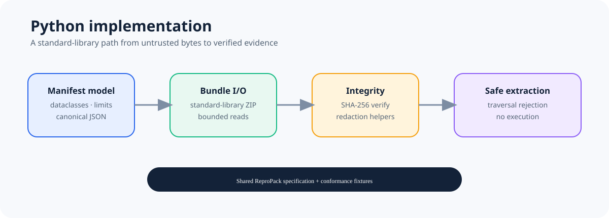

# ReproPack for Python

<p align="center">
  
</p>

<p align="center"><strong>Native Python support for the language-neutral ReproPack evidence-bundle format.</strong></p>

<p align="center">
  <a href="https://github.com/ReproPack/repropack-python/actions/workflows/ci.yml"></a>
  <a href="LICENSE"></a>
  <a href="https://github.com/ReproPack/repropack-core/blob/main/docs/SPECIFICATION.md"></a>
</p>

This implementation uses the Python standard library to validate manifests, create and read stored-ZIP bundles, verify evidence, apply explicit redactions, and extract safely. It does not import or execute Rust.

## What you get

- typed Python models for manifests, evidence, limits, and errors;
- canonical JSON and SHA-256 integrity checks;
- bounded archive reads and safe extraction;
- explicit redaction helpers with advisory warnings;
- shared semantic fixtures used by the ReproPack ecosystem.

The canonical specification lives in [repropack-core](https://github.com/ReproPack/repropack-core/blob/main/docs/SPECIFICATION.md). The intended distribution name is `repropack`; registry publication remains a separate release decision.

## Quick start

Create an isolated environment and install the project locally:

```bash
python -m venv .venv
# macOS/Linux
source .venv/bin/activate
# Windows PowerShell: .venv\Scripts\Activate.ps1
python -m pip install --upgrade pip
python -m pip install .
python -m unittest discover -s tests -v
```

The SDK is exported from the `repropack` package. Build distribution artifacts with:

```bash
python -m build
```

For the format walkthrough, see the Core [tutorial](https://github.com/ReproPack/repropack-core/blob/main/docs/TUTORIAL.md).

## Project map

| Need | Start here |
| --- | --- |
| Understand the format | [Core specification](https://github.com/ReproPack/repropack-core/blob/main/docs/SPECIFICATION.md) |
| See Python API behavior | [Specification mapping](docs/SPECIFICATION_MAPPING.md) |
| Understand implementation boundaries | [Architecture](docs/ARCHITECTURE.md) |
| Run tests and contribute | [Development guide](docs/DEVELOPMENT.md) |
| Review compatibility | [Conformance guide](docs/CONFORMANCE.md) |
| Follow project progress | [Roadmap](ROADMAP.md) |

## Status

The current implementation passes the shared semantic fixtures and the coordinated cross-language interoperability matrix. Future integrations and PyPI publication are not implied by that result.

## License

MIT. See [LICENSE](LICENSE).
